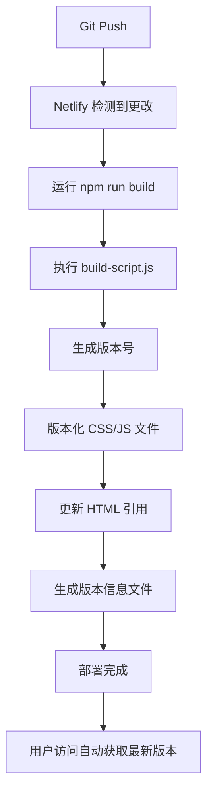

# 🚀 Netlify 自动版本管理部署指南

## 📋 功能概述

此配置实现完全自动化的版本管理，每次 Git 推送都会：
- ✅ 自动生成版本号
- ✅ 版本化所有静态资源
- ✅ 更新HTML中的资源引用
- ✅ 生成版本信息文件
- ✅ 实时检测并通知用户更新

**🎯 最重要的是：用户每次访问都能获取最新版本，无需手动操作！**

## 🛠️ Netlify 后台设置步骤

### 1. 📁 GitHub 集成设置

1. **登录 [app.netlify.com](https://app.netlify.com)**
2. **点击 "New site from Git"**
3. **选择 GitHub 并授权**
4. **选择您的仓库**

### 2. 🔧 构建设置

在 **Build settings** 页面设置：

```
Build command: npm run build
Publish directory: .
```

**✅ 重要**：确保这些设置与您的 `netlify.toml` 一致

### 3. 🌐 环境变量设置（可选）

在 **Site settings → Environment variables** 中可以添加：

| 变量名 | 值 | 说明 |
|--------|----|----|
| `NODE_VERSION` | `18` | Node.js 版本 |
| `NETLIFY_BUILD_VERSION` | `auto` | 自动版本标识 |
| `FORCE_HTTPS` | `true` | 强制 HTTPS |

### 4. 📦 部署设置

在 **Site settings → Build & deploy** 中：

#### **Deploy contexts**
- ✅ **Production branch**: `main` (或您的主分支)
- ✅ **Deploy previews**: 启用
- ✅ **Branch deploys**: 启用

#### **Build hooks** (可选)
创建构建钩子用于手动触发部署：
1. 点击 **Add build hook**
2. 命名：`Manual Deploy`
3. 分支：`main`
4. 保存并复制 Webhook URL

### 5. 🎯 域名设置

在 **Site settings → Domain management** 中：
- ✅ 设置自定义域名（可选）
- ✅ 启用 **Force HTTPS**
- ✅ 启用 **Pretty URLs**

## 🚀 自动部署工作流程

### 提交代码 → 自动部署流程



### 版本号生成策略

1. **优先级1**: 使用 Netlify 的 `DEPLOY_ID`
2. **优先级2**: 使用构建时间戳 `YYYYMMDDHHMMSS`
3. **备用方案**: 当前时间戳

### 自动版本检测

- ⏱️ 每30秒自动检查更新
- 🔗 支持多种版本源：
  - `/version.json` (推荐)
  - `/VERSION.txt` (备用)
  - `/.netlify/functions/version` (API方式)

## 📊 验证部署是否成功

### 1. 🔍 查看构建日志

在 Netlify 管理后台：
1. 进入您的网站
2. 点击 **Deploys** 标签
3. 点击最新部署查看详细日志
4. 寻找以下成功标识：

```
🚀 开始 Netlify 自动构建...
📅 构建版本: 20241203145621
✅ CSS: styles.css → styles.20241203145621.css
✅ JS: js/main.js → js/main.20241203145621.js
✅ 已更新: code_generator.html
✅ 版本信息文件已生成
🎉 构建成功完成！
```

### 2. 🌐 测试网站功能

访问您的网站并：

1. **检查版本显示**：
   - 页面右下角应显示版本号
   - 点击版本号可手动检查更新

2. **验证版本文件**：
   ```
   https://your-site.netlify.app/version.json
   https://your-site.netlify.app/VERSION.txt
   https://your-site.netlify.app/.netlify/functions/version
   ```

3. **测试自动更新**：
   - 修改代码并推送
   - 等待部署完成
   - 原有页面应显示更新通知

### 3. 🧪 使用测试脚本验证

```bash
# 测试缓存配置
./test_cache.sh https://your-site.netlify.app

# 检查版本API
curl https://your-site.netlify.app/.netlify/functions/version
```

## 🔧 常见问题排查

### 构建失败

1. **检查构建日志**：
   - 确认 Node.js 版本兼容
   - 检查依赖安装是否成功
   - 验证 `build-script.js` 是否正确执行

2. **常见错误解决**：
   ```bash
   # 依赖安装失败
   Error: Cannot find module 'glob'
   → 检查 package.json 中的依赖配置
   
   # 文件权限错误
   Error: EACCES: permission denied
   → 检查文件是否存在且可读
   
   # 构建脚本错误
   Error: Cannot read property 'replace' of undefined
   → 检查 HTML 文件是否包含正确的占位符
   ```

### 版本检测不工作

1. **检查版本文件**：
   ```bash
   curl https://your-site.netlify.app/version.json
   ```

2. **浏览器控制台检查**：
   ```javascript
   // 检查版本管理器是否加载
   console.log(typeof versionManager);
   
   // 手动触发版本检查
   versionManager.checkForUpdates();
   ```

### 缓存问题

1. **强制部署**：
   - 在 Netlify 后台使用 "Clear cache and deploy site"

2. **检查缓存头**：
   ```bash
   curl -I https://your-site.netlify.app/
   ```

## 🎯 高级配置

### 1. 自定义构建命令

在 `netlify.toml` 中可以自定义：

```toml
[build]
  command = "npm run build && npm run post-build"

[build.environment]
  CUSTOM_VERSION_PREFIX = "v"
  BUILD_MODE = "production"
```

### 2. 分支部署策略

```toml
[context.production]
  command = "npm run build:prod"

[context.branch-deploy]
  command = "npm run build:dev"

[context.deploy-preview]
  command = "npm run build:preview"
```

### 3. 自定义域名和 CDN

- 设置自定义域名提升专业性
- 启用 Netlify CDN 加速全球访问
- 配置 DNS 记录指向 Netlify

## 📈 监控和优化

### 1. 性能监控

- 使用 Netlify Analytics 查看访问统计
- 监控页面加载时间
- 观察版本更新频率

### 2. 用户体验优化

- 调整版本检查间隔（默认30秒）
- 优化更新通知样式
- 设置合理的缓存策略

### 3. 部署优化

- 使用分支保护规则
- 设置自动化测试
- 配置部署通知

## 🎉 最佳实践总结

1. **✅ 推荐做法**：
   - 保持小而频繁的更新
   - 每次推送前本地测试
   - 监控构建日志
   - 定期检查网站性能

2. **❌ 避免做法**：
   - 不要手动修改生成的版本文件
   - 不要在生产分支直接推送大量更改
   - 不要忽略构建警告

3. **🔄 维护建议**：
   - 定期更新依赖包
   - 关注 Netlify 功能更新
   - 收集用户反馈优化体验

---

## 🆘 需要帮助？

- 📧 查看构建日志获取详细错误信息
- 🔍 使用浏览器开发者工具调试
- 🌐 访问 [Netlify 文档](https://docs.netlify.com/) 获取更多信息

**🎯 设置完成后，您的网站将实现完全自动化的版本管理，用户每次访问都能获取最新版本！** 