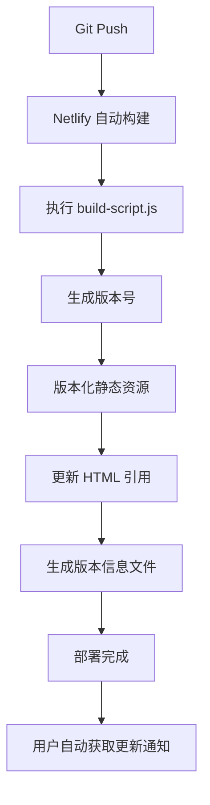

# 🚀 自动版本管理系统

## 📋 功能概述

蓝牙指令代码生成器已实现完全自动化的版本管理，确保用户总是访问到最新版本，无需任何手动操作。

## 🛠️ 系统架构

### 核心组件

| 文件 | 功能 | 说明 |
|------|------|------|
| `build-script.js` | 自动构建处理器 | Netlify 构建时执行，处理版本化 |
| `js/version-manager.js` | 前端版本检测 | 自动检测版本更新并提示用户刷新 |
| `netlify/functions/version.js` | 版本查询API | 提供实时版本信息 |
| `netlify.toml` | 平台配置 | Netlify 构建和缓存策略 |
| `package.json` | 项目配置 | 依赖和构建脚本定义 |
| `_headers` | 缓存配置 | HTTP 缓存头设置 |

### 自动化流程



## ⚙️ 版本管理机制

### 1. 版本号生成
- **优先级1**: Netlify DEPLOY_ID（生产环境）
- **优先级2**: 构建时间戳 `YYYYMMDDHHMMSS`
- **格式示例**: `20241203145621` 或 `67a8c9b2e1f4`

### 2. 文件版本化
构建时自动处理：
```
styles.css → styles.20241203145621.css
js/main.js → js/main.20241203145621.js
```

### 3. 缓存策略
- **HTML文件**: 不缓存 (`no-cache, no-store`)
- **版本化资源**: 长期缓存 (`max-age=31536000, immutable`)
- **版本信息**: 实时更新 (`no-cache`)

### 4. 前端检测
- **检查频率**: 每30秒
- **检测源**: `/version.json` → `/VERSION.txt` → `/.netlify/functions/version`
- **通知机制**: 发现新版本时显示更新提醒

## 🎯 用户体验

### 自动更新流程
1. **开发者推送代码** → 自动构建部署
2. **用户正在使用网站** → 后台检测到新版本
3. **显示更新通知** → 用户点击"立即刷新"
4. **强制刷新页面** → 获取最新版本

### 通知特性
- 🎨 **美观界面**: 渐变背景，动画效果
- 🔔 **智能提醒**: 5分钟内不重复通知
- ⚡ **一键更新**: 清除缓存并刷新
- 💡 **版本显示**: 页面右下角版本号

## 🔍 监控和调试

### 浏览器控制台

检查版本管理器状态：
```javascript
// 查看当前版本
console.log('当前版本:', versionManager.currentVersion);

// 手动检查更新
versionManager.checkForUpdates();

// 查看版本信息
console.log(versionManager.getVersionInfo());

// 强制刷新
versionManager.forceRefresh();
```

### 版本API检查

验证版本信息：
```bash
# JSON 格式（推荐）
curl https://your-site.netlify.app/version.json

# 文本格式
curl https://your-site.netlify.app/VERSION.txt

# API 接口
curl https://your-site.netlify.app/.netlify/functions/version
```

### 构建日志查看

在 Netlify 管理后台查看构建状态：
```
🚀 开始 Netlify 自动构建...
📅 构建版本: 20241203145621
✅ CSS: styles.css → styles.20241203145621.css
✅ JS: js/main.js → js/main.20241203145621.js
✅ 已更新: code_generator.html
✅ 版本信息文件已生成
🎉 构建成功完成！
```

## 🚨 故障排除

### 构建失败

**症状**: 部署失败，网站无法访问
**检查**: Netlify 构建日志
**常见原因**:
- `package.json` 依赖问题
- `build-script.js` 执行错误
- Node.js 版本不兼容

**解决方案**:
```bash
# 本地测试构建
npm install
npm run build

# 检查依赖
npm audit
```

### 版本检测失效

**症状**: 页面不显示版本号或不检测更新
**检查**: 浏览器控制台错误
**验证**:
```javascript
// 检查版本管理器是否加载
typeof versionManager !== 'undefined'

// 手动触发检测
versionManager.checkForUpdates()
```

### 缓存问题

**症状**: 用户仍看到旧版本
**解决**:
1. 检查缓存头配置
2. 验证版本化文件是否生成
3. 确认 HTML 引用是否更新

**测试缓存配置**:
```bash
# 使用测试脚本（如果保留）
./test_cache.sh https://your-site.netlify.app

# 手动检查缓存头
curl -I https://your-site.netlify.app/
```

## 📊 性能优化

### 缓存效率
- ✅ HTML 文件始终最新
- ✅ 静态资源充分缓存
- ✅ API 响应实时更新

### 加载性能
- ✅ 版本管理器异步加载
- ✅ 版本检测不阻塞页面
- ✅ 智能通知避免干扰

### 网络优化
- ✅ 版本文件轻量化
- ✅ API 响应压缩
- ✅ CDN 分发加速

## 🎉 最佳实践

### 开发工作流
1. **本地开发** → 功能完成后推送
2. **自动部署** → Netlify 自动构建
3. **验证更新** → 检查版本号和功能
4. **用户通知** → 系统自动处理

### 版本发布策略
- 🔄 **小步快跑**: 频繁的小更新比大版本更安全
- 🧪 **预览部署**: 利用 Netlify 分支部署测试
- 📊 **监控反馈**: 关注用户更新响应率

### 维护建议
- 📅 **定期检查**: 监控构建日志和错误率
- 🔧 **依赖更新**: 保持 Node.js 和依赖包最新
- 📈 **性能监控**: 使用 Netlify Analytics 分析

## 📝 配置参考

### 版本检测间隔调整

在 `js/version-manager.js` 中：
```javascript
// 默认30秒，可根据需要调整
this.versionCheckInterval = 30000; // 毫秒
```

### 通知显示时间

```javascript
// 默认8秒自动隐藏
setTimeout(() => {
    notification.remove();
}, 8000);
```

### 缓存策略自定义

在 `netlify.toml` 中调整：
```toml
# 短期缓存（5分钟）
Cache-Control = "public, max-age=300, must-revalidate"

# 长期缓存（1年）
Cache-Control = "public, max-age=31536000, immutable"
```

---

## 🎯 总结

这套自动版本管理系统实现了：
- ✅ **零维护**: 推送代码即自动更新
- ✅ **用户友好**: 智能通知和一键刷新
- ✅ **高性能**: 智能缓存策略
- ✅ **可靠性**: 多重检测机制

**💡 提示**: 系统已完全自动化，您只需专注于代码开发，版本管理完全无需干预！ 